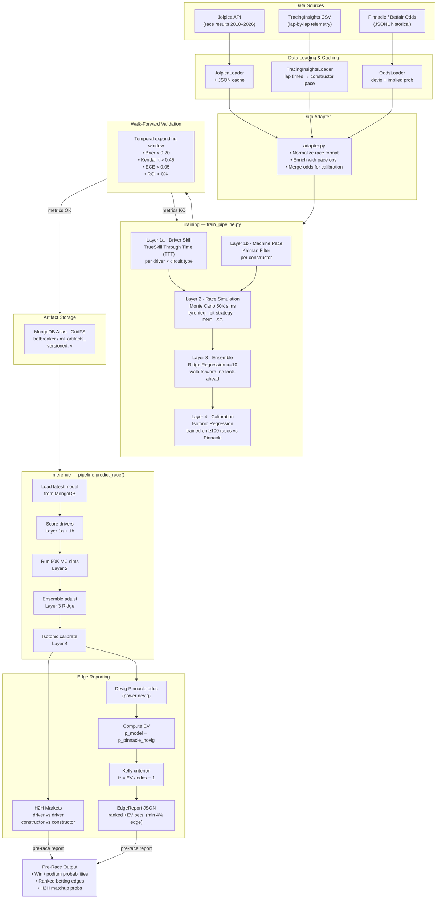

# F1 Predictor — Workflow

## End-to-End Pipeline



---

## Execution Contexts

| Context | Command / Entry Point | Trigger |
|---------|----------------------|---------|
| **Training** | `python train_pipeline.py --year 2026 --through-round N` | After each race (local) |
| **Inference** | `pipeline.predict_race(race, grid, odds)` | Pre-race (Saturday post-quali) |
| **H2H extension** | `pipeline_h2h_extension.py` | Same timing as inference |
| **Diagnostics** | `python debug_pace.py` | On demand |
| **DB check** | `python test_mongo.py` | On demand |

## Key CLI Flags — `train_pipeline.py`

| Flag | Default | Purpose |
|------|---------|---------|
| `--year` | required | Season to train |
| `--through-round` | required | Last round included |
| `--train-from` | 2019 | Training window start |
| `--val-from` | 2023 | Validation window start |
| `--n-mc-sim` | 50000 | Monte Carlo simulations |
| `--ridge-alpha` | 10.0 | Ridge regularization |
| `--dry-run` | false | Train without saving |
| `--synthetic` | false | Force synthetic data |
| `--rollback` | — | Restore previous version |

## Performance Targets

| Metric | Target | Description |
|--------|--------|-------------|
| Brier Score | < 0.20 | Win probability calibration |
| Kendall τ | > 0.45 | Finishing-order ranking |
| ECE | < 0.05 | Expected calibration error |
| ROI | > 0% | Simulated fractional-Kelly return |
```
