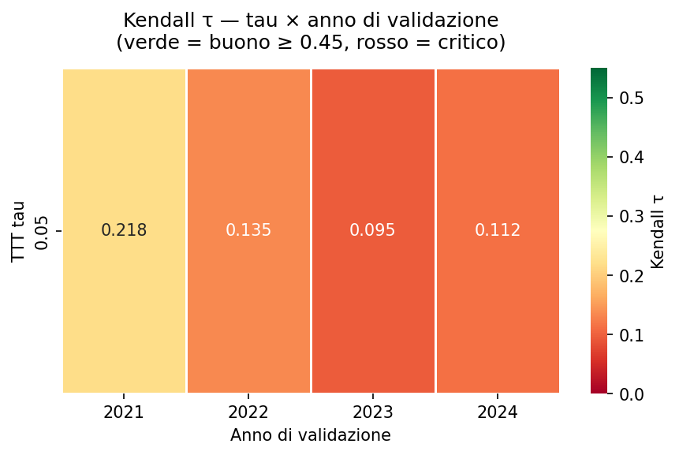
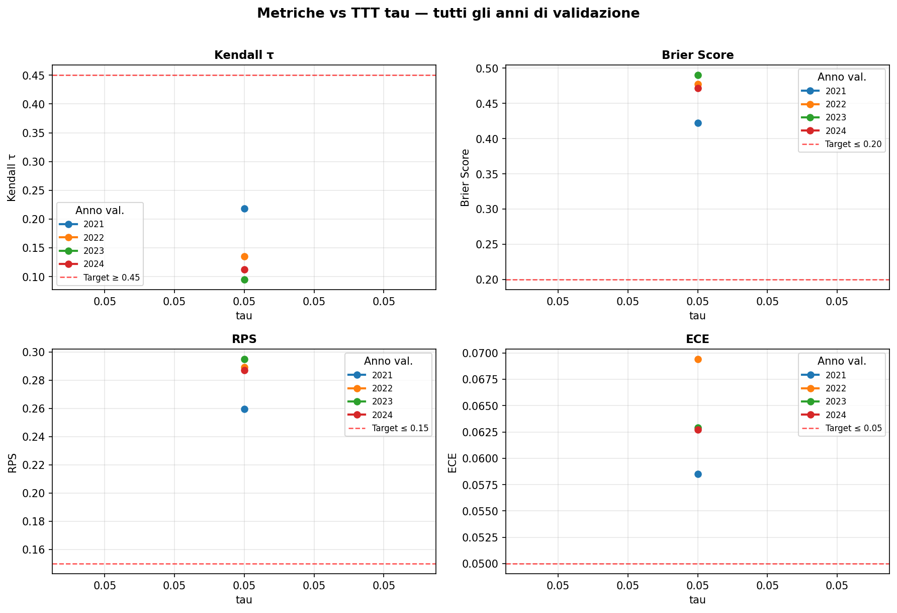
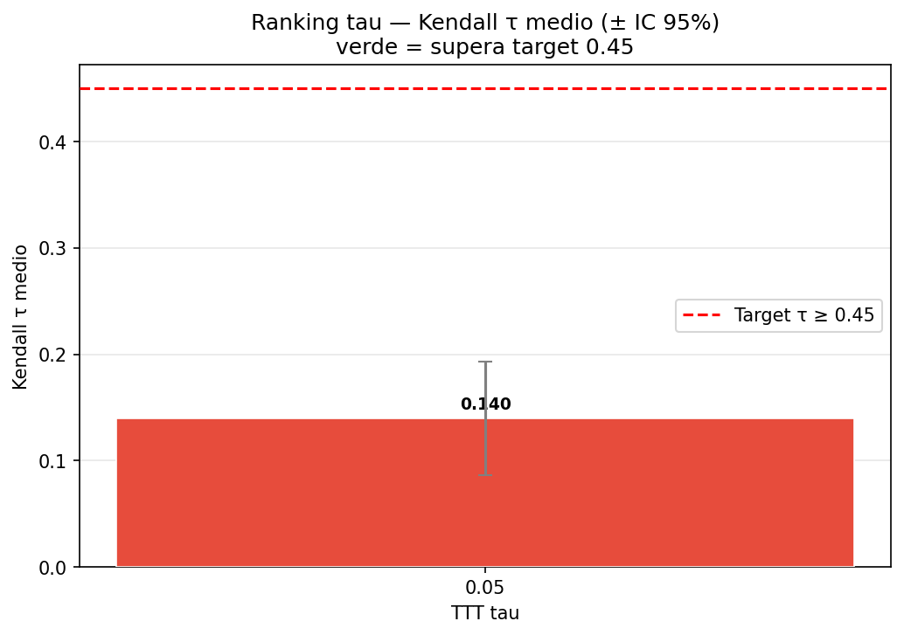
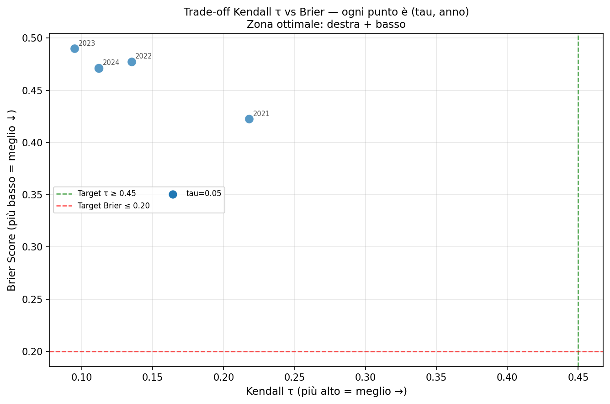

# TTT Tau Grid Search — Report 2026-04-16 11:15 UTC
**Run**: [local]()  
**tau testati**: `n/a`  
**anni validazione**: `n/a`  
**MC sim per job**: `n/a`

## Kendall τ per combinazione tau × anno
| tau | 2021 | 2022 | 2023 | 2024 | **media** |
|-----|-------|-------|-------|-------|----------|
| `0.05` | +0.218 ⚠️ | +0.135 ⚠️ | +0.095 ⚠️ | +0.112 ⚠️ | **+0.140** |

## Raccomandazione
**tau ottimale = `0.05`** (Kendall τ medio = `+0.140`) — ⚠️ **non raggiunge il target ≥ 0.45**

> Per applicare: modificare `TTTConfig.tau` in `f1_predictor/models/driver_skill.py:71`

*Baseline pre-regressione (tau=0.833): τ=+0.451 ✅*

## Metriche complete per tutti i tau
| tau | anno | Kendall τ | Brier | RPS | LogLoss | ECE | N gare |
|-----|------|-----------|-------|-----|---------|-----|--------|
| `0.05` | 2021 | `0.218` ⚠️ | `0.4225` ⚠️ | `0.2597` ⚠️ | `9.8436` ⚠️ | `0.0585` ⚠️ | 22 |
| `0.05` | 2022 | `0.135` ⚠️ | `0.4776` ⚠️ | `0.2891` ⚠️ | `10.1778` ⚠️ | `0.0694` ⚠️ | 22 |
| `0.05` | 2023 | `0.095` ⚠️ | `0.4900` ⚠️ | `0.2948` ⚠️ | `10.1604` ⚠️ | `0.0629` ⚠️ | 22 |
| `0.05` | 2024 | `0.112` ⚠️ | `0.4714` ⚠️ | `0.2869` ⚠️ | `9.7258` ⚠️ | `0.0627` ⚠️ | 24 |

## Grafici
### 1. Heatmap Kendall τ (tau × anno)

### 2. Metriche vs tau per anno

### 3. Ranking tau — Kendall τ medio

### 4. Trade-off Kendall τ vs Brier

## Analisi statistica
| tau | media τ | std τ | min τ | max τ | n anni |
|-----|---------|-------|-------|-------|--------|
| `0.05` | +0.140 | 0.055 | +0.095 | +0.218 | 4 |
